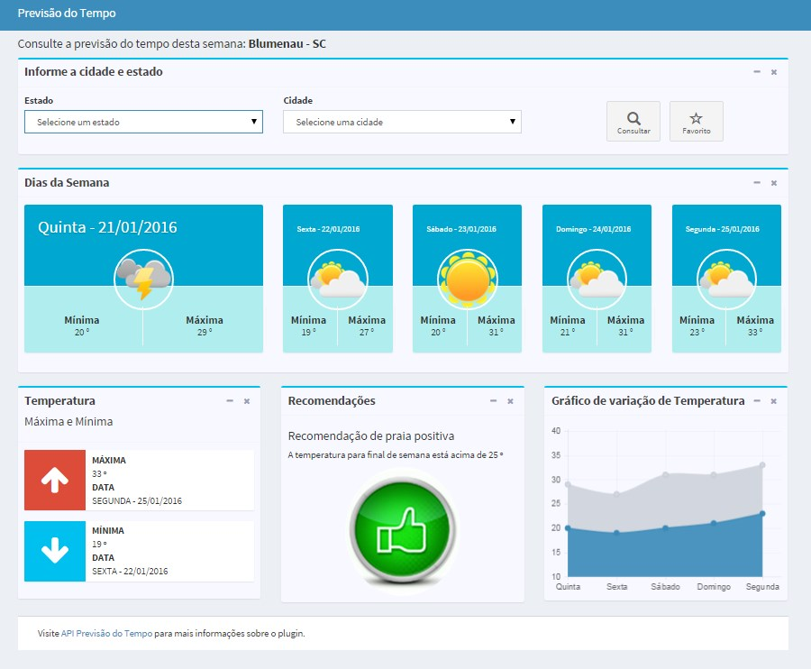
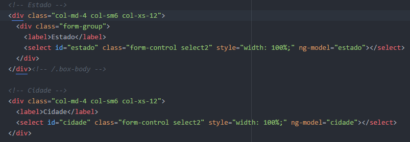
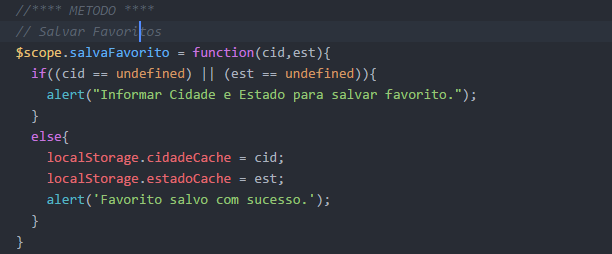

## Protótipo Previsão do Tempo

## 1 – Objetivo
There are a few different ways you can install pyechonest:

Objetivo deste protótipo realizar consulta da previsão do tempo com base na cidade e estado selecionada. Exibir a máxima e mínima do dia atual e dias seguintes da semana. Box de consulta de estado e cidade aonde será necessário selecionar um estado e cidade. Ao acessar pela primeira vez a cidade e estado padrão será Blumenau – Santa Catariana. Box temperatura que será exibida a temperatura máxima e mínima da semana. Box recomendações que verificará que no sábado a temperatura é maior que 25 ° mostrará recomendação de praia positivo caso contrário negativará a recomendação de praia. Box do gráfico de variação de temperatura da semana, exibirá um gráfico linear com máximas e mínimas dos dias exibidos.

   
## 2 – Funcionalidades
##2.1 – Selecionar estado e cidades##

Para carregar os estados e cidades foi utilizado um javascript que trata de carregar os dados de estado e cidade, javascript: cidades-estados-1.4-utf8.js. Para utilizar foi criado um <select> no HTML com ID de estado e cidade.

##2.2 – Realizar consulta

Para consultar os dados previsão do tempo foi utilizada um API que retorna um json(javascript object notation) com os dados da previsão. API utilizada foi http://developers.agenciaideias.com.br. Nesta API é necessário passar cidade e estado para receber o retorno em json.

Método que para carregar dados da API concatenando cidade e estado selecionado pela interface.

##2.3 – Salvar favorito

Ao selecionar cidade e estado poderá salvá-las como favorito, assim que abrir a página novamente já carregará os dados referente a cidades-estados salvos como favorito.

Método utilizado para salvar favoritos: Ao clicar no botão de favoritos salvará estado e cidade no localStorage, ao acessar novamente a página será verificado se existem dados salvos no localStorage  e carregar a previsão com base na cidades-estados favorito.

Método para salvar favorito:

##3 – Conclusão
